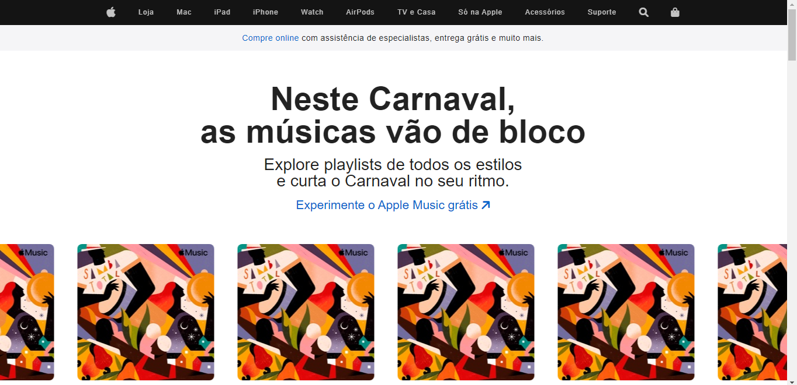
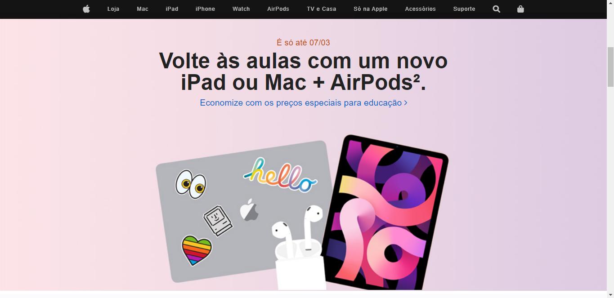
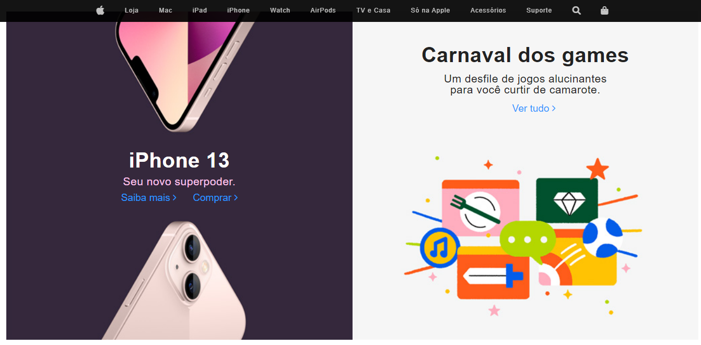
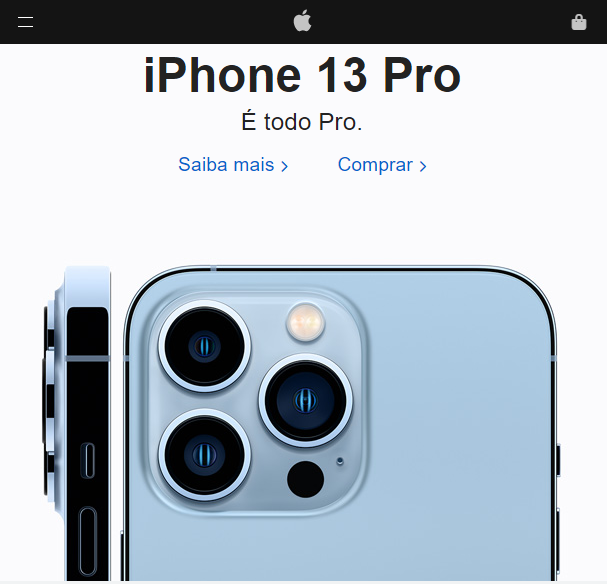
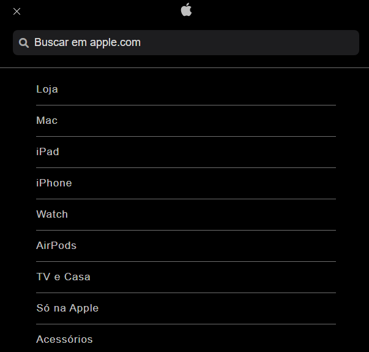
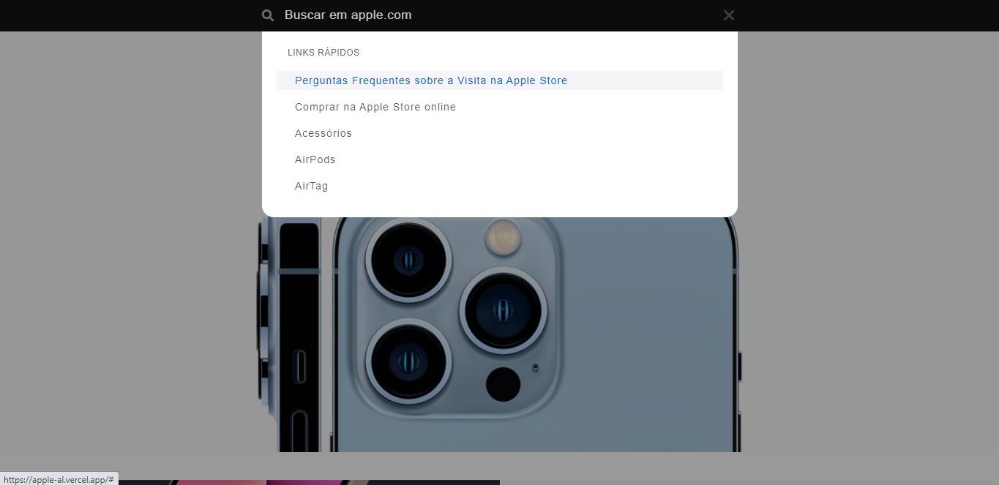

<h1 align="center">Apple</h1>

# ✉ About

A responsive clone of 🍎 Apple's 🍎 website.

## ⚠ IMPORTANT: This project was made for educational purposes only. All rights are reserved to Apple. ⚠

# 🌆 Images








# 👩‍💻 Technologies Used

- HTML
- CSS
- JavaScript

# ⬇ How to download the project

```bash
git clone https://github.com/arthur-lage/apple.git

cd apple

# Open index.html using your favorite browser
```

# 💻 Use the website

Click the link below to access the website:

[Apple Clone](https://apple-al.vercel.app)
